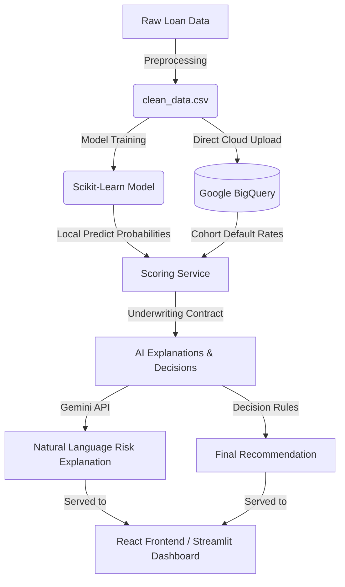

# 🏦 AI-Powered Loan Underwriting & Risk Analysis System

An end-to-end loan underwriting and credit risk assessment application. The system combines modern machine learning (Scikit-Learn risk modeling), cloud analytics (Google BigQuery cohort querying), generative AI (Gemini risk explanations), and a premium modern user interface (Vite + React + TSX + Tailwind CSS & Python Streamlit).

---

## 🏗️ System Architecture



---

## 📁 Repository Structure

```
├── .venv/                      # Python virtual environment
├── .vscode/                    # VS Code workspace configurations
├── data/                       # Local data directory (CSV files & trained models)
├── frontend/                   # Modern React + Vite + TypeScript web client
│   ├── src/
│   │   ├── pages/              # App Views (Dashboard, Assessment, History, Settings)
│   │   ├── components/         # Reusable Tailwind UI components
│   │   └── services/           # API integration clients
│   └── package.json            # Node/Vite build configurations
├── src/                        # Backend Python packages
│   ├── person_a/               # Data science & Cloud operations
│   │   ├── clean_data.py       # Data preprocessing
│   │   ├── train.py            # Model training & serialization
│   │   ├── cloud_upload.py     # Direct CSV load to BigQuery
│   │   └── scoring_service.py  # Inference & BQ cohort engine
│   └── person_b/               # Streamlit application & Decision layers
│       ├── app.py              # Streamlit dashboard
│       ├── explain_api.py      # Gemini explanation engine
│       └── decision_engine.py  # Credit approval decisioning
├── tests/                      # Automated test suite
└── requirements.txt            # Python dependencies
```

---

## 🛠️ Getting Started

### Prerequisites
* **Python 3.10+**
* **Node.js v18+** & **npm**
* **Google Cloud SDK (gcloud)** authenticated to a GCP project.

### 1. Environment Configuration
Create a `.env` file in the root directory:
```ini
# Gemini API Configuration
GEMINI_API_KEY=your_gemini_api_key

# Google Cloud Configuration
GCP_PROJECT_ID=your_gcp_project_id
```

Configure Application Default Credentials (ADC) for Google Cloud:
```bash
gcloud auth application-default login
```

---

### 2. Backend & Data Pipeline Setup (Python)

Activate the virtual environment and install packages:
```bash
# Activate Virtual Environment (Windows PowerShell)
.venv\Scripts\Activate.ps1

# Install requirements
pip install -r requirements.txt
```

Run the data preparation pipeline:
```bash
# 1. Clean raw data and save locally
python src/person_a/clean_data.py

# 2. Train local risk prediction model
python src/person_a/train.py

# 3. Load clean dataset directly into BigQuery
python src/person_a/cloud_upload.py
```

---

### 3. Run the Streamlit Dashboard (Option A)
To run the quick Streamlit-based UI:
```bash
python -m streamlit run src/person_b/app.py
```
This serves a Python-based web app at `http://localhost:8501`.

---

### 4. Run the Premium React Frontend (Option B)
To run the modern production-ready React client:
```bash
# Navigate to the frontend directory
cd frontend

# Install Node modules
npm install

# Start Vite local development server
npm run dev
```
Open [http://localhost:5173](http://localhost:5173) in your browser to access the application.

---

## 🧠 Key Features

1. **Machine Learning Classifier**: Trains an ensemble classification pipeline predicting applicant default probability based on credit profiles (income, credit lines, historical delinquencies, debt ratio, dependents).
2. **Direct BigQuery Ingest**: Bypasses intermediate stages and uploads data directly to BigQuery tables using idempotent chunked writes (`WRITE_TRUNCATE`).
3. **Dynamic Cohort Analysis**: Instantly queries historical database bands (income ±15% and same credit lines) in BigQuery at inference time to contextually anchor applicant performance.
4. **GenAI Interpretability**: Queries Gemini using systemic risk profiles to produce readable explanations of complex numeric risk indexes.
